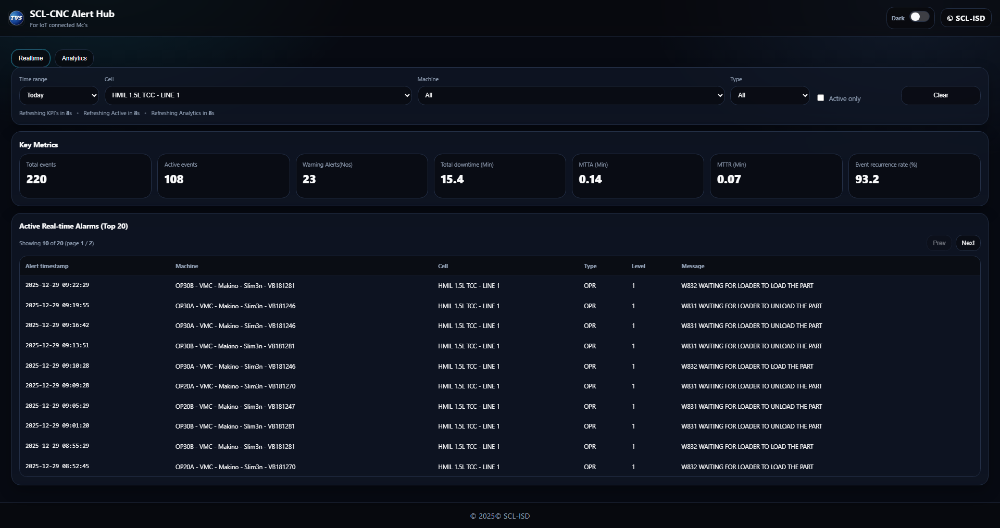
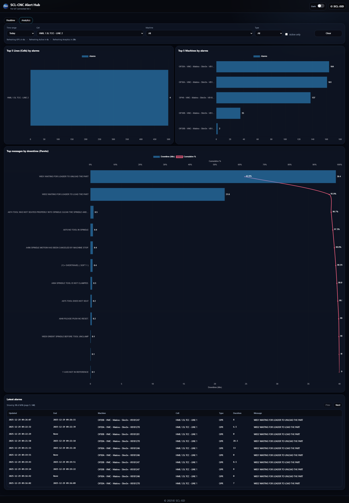

# CNC Alarm Monitoring System

### Real-Time CNC Machine Alarm Analytics Platform


A **real-time CNC alarm monitoring platform** designed for **manufacturing production lines**.
The system continuously collects machine alarms from a **MySQL database** and displays them through a **live dashboard with analytics, KPIs, and alarm trends**.


This tool enables **production engineers and maintenance teams** to monitor machine health, detect recurring alarms, and improve uptime.

---

# System Overview

The CNC Alarm Monitoring System performs the following tasks:

1. **Collects machine alarm records from MySQL**
2. **Processes alarms in real time**
3. **Generates machine health KPIs**
4. **Displays alarm analytics dashboards**
5. **Tracks active machine alarms**

The system refreshes alarm information at configurable intervals.

---

# Industrial Architecture

```text
CNC Machines
      │
      │ Alarm Signals
      ▼
Machine Controller / PLC
      │
      ▼
Machine Data Logger
      │
      ▼
MySQL Database
      │
      ▼
Alarm Monitoring Service
      │
      ▼
Analytics Engine
      │
      ▼
Web Dashboard
      │
      ▼
Maintenance Team Alerts
```

---

# Database Configuration

The system reads machine alarms from a MySQL database.

Example configuration:

```text
MYSQL_HOST=127.0.0.1
MYSQL_PORT=3306
MYSQL_USER=root
MYSQL_PASSWORD=******
MYSQL_DATABASE=mt_linki_1
MYSQL_TABLE=MT_LINKI_1
```

Alarm records are fetched from the database at scheduled intervals.

---

# Refresh Configuration

Dashboard refresh intervals:

| Parameter                 | Description          | Default |
| ------------------------- | -------------------- | ------- |
| REFRESH_KPI_SECONDS       | KPI refresh interval | 10 sec  |
| REFRESH_ACTIVE_SECONDS    | Active alarm refresh | 10 sec  |
| REFRESH_ANALYTICS_SECONDS | Analytics refresh    | 60 sec  |

These values are configurable in the `.env` file.

---

# Project Structure

```text
cnc-alarm-monitor
│
├── main.py
├── dashboard.py
├── alarm_processor.py
├── database.py
│
├── config
│   └── .env
│
├── analytics
│   ├── kpi_engine.py
│   └── alarm_statistics.py
│
├── ui
│   └── dashboard.html
│
└── requirements.txt
```

---

# Features

### Real-Time Alarm Monitoring

Continuously monitors machine alarms from database.

### Machine Health KPIs

Displays important metrics:

* Active alarms
* Alarm frequency
* Machine uptime
* Alarm distribution

### Alarm Analytics

Provides historical alarm insights:

* Top recurring alarms
* Alarm frequency trends
* Machine-wise alarm distribution

### Live Dashboard

Industrial UI displaying:

* Machine status
* Active alarms
* KPI cards
* Alarm trends

---

# Example Dashboard Widgets

The monitoring dashboard provides:

### Active Alarm Table

Displays currently active alarms.

### Alarm Trend Chart

Shows alarm frequency over time.

### Top Alarm Analysis

Identifies most frequent alarm types.

### Machine Alarm Distribution

Breakdown of alarms per CNC machine.

---

# Installation

Clone the repository

```bash
git clone https://github.com/yourusername/cnc-alarm-monitor.git
cd cnc-alarm-monitor
```

Install dependencies

```bash
pip install -r requirements.txt
```

---

# Environment Configuration

Create `.env` file:

```bash
cp .env.example .env
```

Example configuration:

```env
MYSQL_HOST=127.0.0.1
MYSQL_PORT=3306
MYSQL_USER=root
MYSQL_PASSWORD=your_password
MYSQL_DATABASE=mt_linki_1
MYSQL_TABLE=MT_LINKI_1
```

---

# Running the System

Start the monitoring service:

```bash
python main.py
```

The dashboard will start and connect to the database.

---

# Dashboard Access

Open browser:

```text
http://localhost:8000
```

Dashboard displays:

* machine alarms
* real-time analytics
* maintenance insights

---

# Alarm Data Example

Example alarm record:

```json
{
  "machine_id": "CNC_01",
  "alarm_code": "ALM_1042",
  "alarm_description": "Spindle overload",
  "timestamp": "2026-03-10 14:35:22",
  "status": "ACTIVE"
}
```

---

# Industrial Use Cases

This system is useful for:

### Smart Manufacturing

Monitor CNC machines across production lines.

### Predictive Maintenance

Detect frequently occurring alarms before machine failure.

### Production Analytics

Analyze alarm patterns affecting productivity.

### Maintenance Automation

Provide early alerts to maintenance teams.

---

# Future Improvements

Planned enhancements:

* Email / Teams alarm alerts
* Predictive alarm detection using AI
* Machine downtime analytics
* OEE dashboard integration
* Multi-plant monitoring

---

# Author

Karthikeyan
Industrial Automation | IIoT | Smart Manufacturing Systems

---

# License

MIT License