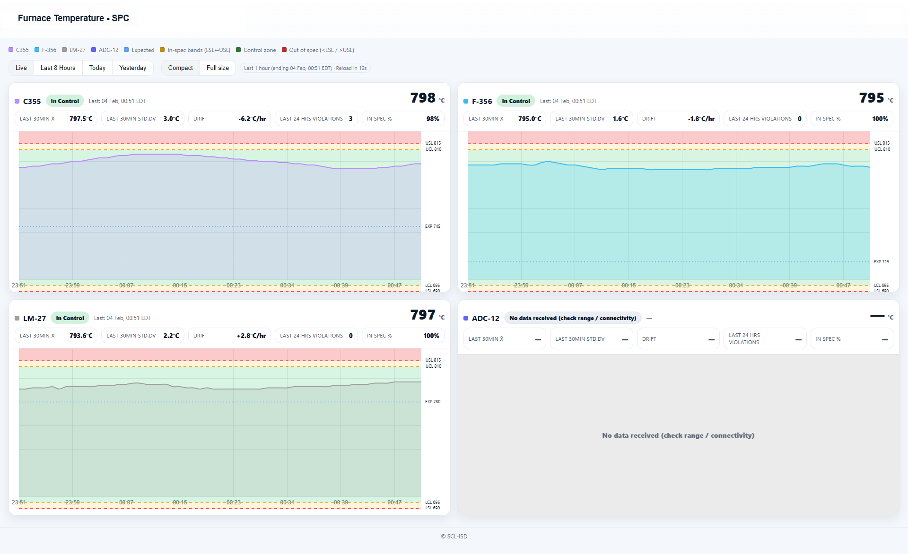
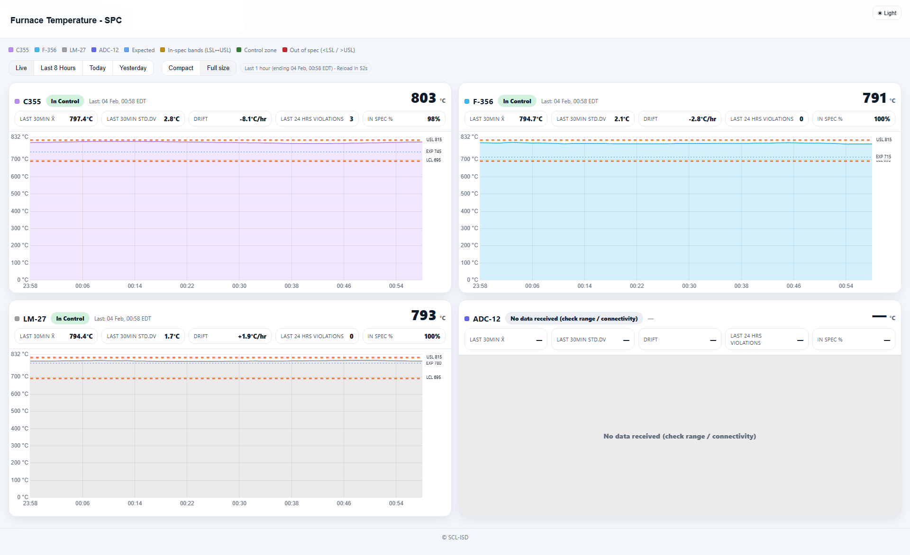

# Furnace Watch (Bath Temperature SPC Dashboard)

<table width="100%" cellspacing="0" cellpadding="14">
  <tr>
    <!-- Left half -->
    <td width="50%" bgcolor="#ffffff" align="center" valign="top">
      <b>Compact Band-view</b><br><br>
      
    </td>
    <!-- Right half -->
    <td width="50%" bgcolor="#0b1220" align="center" valign="top">
      <b><span style="color:#ffffff">Full-view</span></b><br><br>
      
    </td>
  </tr>
</table>

Furnace Watch is a lightweight web dashboard to monitor **bath temperature** for multiple furnaces and visualize **SPC limits** (LSL/LCL/Expected/UCL/USL) across selectable time ranges.

This project runs as:
- **API server** (Node + Express + MSSQL) → reads furnace tables from SQL Server
- **UI server** (Node + Express static) → serves the dashboard (`index.html`, `app.js`, `styles.css`)

---

## Features

- **Multi-furnace monitoring** (e.g., `C355`, `F-356`, `LM-27`, `ADC-12`)
- **2×2 trend layout** (each furnace has its own trend card)
- **Time ranges**
  - **Live** (last 1 hour)
  - **Last 8 Hours**
  - **Today**
  - **Yesterday**
- **SPC limit overlays**
  - **Lines:** LSL, LCL, Expected, UCL, USL
  - Optional **bands** (depending on build/mode)
- **Light/Dark mode**
- **Connectivity messaging** when data is missing or API/DB is unreachable

---

## Metrics Shown (Per Furnace)

The dashboard calculates and displays these metrics from **bath temperature**:

### Current Value
- **Current Temperature (°C)** — latest reading

### Short-term
Calculated from the most recent available data:
- **LAST 30MIN AVG** — average bath temperature over the last **30 minutes**
- **LAST 30 MIN σ (STD.DV)** — standard deviation over the last **30 minutes** (stability)
- **DRIFT (°C/hr)** — rate of change (trend slope) computed from recent history

### Long-term
Calculated typically from the last 24 hours of data:
- **LAST 24H VIOLATIONS** — number of **excursions** outside spec in the last 24 hours  
  *(an excursion is a continuous out-of-spec period; some builds may debounce)*  
- **IN SPEC 24H (%)** — % of time inside **LSL–USL** in the last 24 hours  
  *(with 1-minute sampling, points ≈ minutes)*

### Status Indicator (Pill)
A status pill summarizes current condition using SPC rules:
- **Out of spec** if temperature is outside **LSL–USL**
- A warning zone may use **LCL–UCL** depending on configuration
- If no data / API failure, the UI shows:
  - **No data received** (API ok but returned 0 points)
  - **Connectivity issue** (API/DB request failed)

---

## Tech Stack

- Node.js (Express)
- MSSQL (`mssql` package)
- Chart.js (CDN)
- Plain HTML/CSS/JS (no build step)

---

## Requirements

- **Node.js** (recommended 18+)
- Access to a **SQL Server** database
- Each furnace table should contain columns:
  - `timestamp`
  - `bath_temp`
  - `LSL`, `USL`, `LCL`, `UCL`, `Expected`

---
## License

**Private use only.**  
This project is intended for internal/private use within the organization.  
Redistribution, resale, or public deployment without permission is not allowed.

---

## Quick Start

### 1) Install dependencies
```bash
npm install