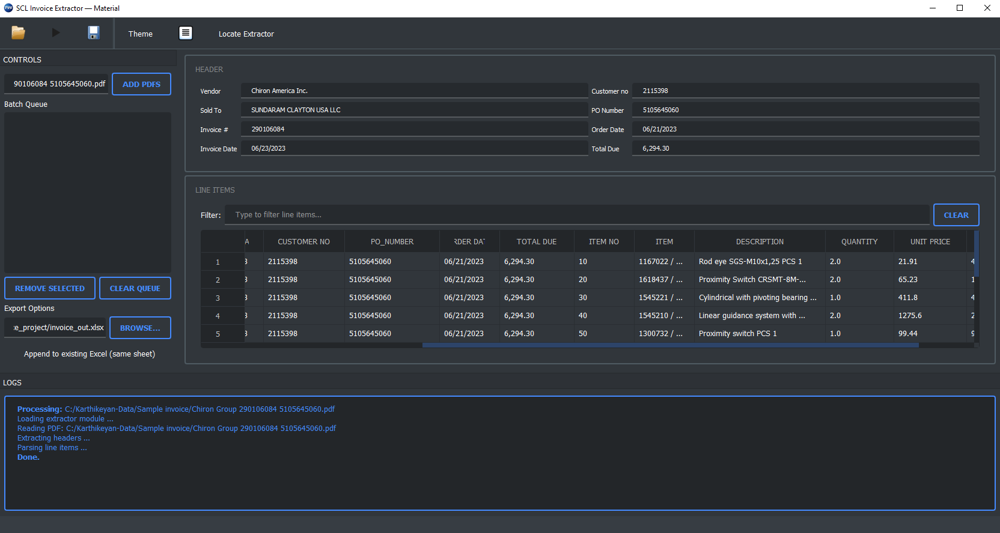

#  Invoice Extractor - OCR Material


A **desktop OCR automation tool** designed to extract structured data from **supplier invoices (PDF)** and convert them into **structured Excel datasets**.

Built for **manufacturing procurement and finance teams**, the application reads invoice PDFs, extracts header information and line items, and exports them into **Excel-ready tables**.

---

# Application Preview

<p align="center">
    
</p>

The interface provides:

* PDF batch queue
* Extracted invoice header fields
* Line item table view
* Excel export functionality
* Real-time processing logs

---

# Key Features

### Intelligent OCR Extraction

Extracts structured invoice data including:

* Vendor
* Sold To
* Invoice Number
* Invoice Date
* Customer Number
* PO Number
* Order Date
* Total Due

### Line Item Parsing

Automatically detects and extracts:

* Item Number
* Item Code
* Description
* Quantity
* Unit Price
* Net Amount

### Batch Processing

* Process multiple PDFs
* Drag-and-drop PDF upload
* Queue-based processing

### Excel Export

Exports structured data to:

```
invoice_out.xlsx
```

Supports:

* Append to existing Excel sheet
* Automatic column alignment
* Multiple invoice rows

---

# System Architecture

```
          Invoice PDF
               │
               ▼
       PDF Text Extraction
       (Poppler / OCR)
               │
               ▼
        Header Extraction
               │
               ▼
        Line Item Parser
               │
               ▼
          Data Structuring
               │
               ▼
        Pandas DataFrame
               │
               ▼
         PyQt Dashboard
               │
               ▼
           Excel Export
```

---

# Example Extracted Data

| Vendor              | Invoice # | PO Number  | Item    | Description              | Qty | Unit Price |
| ------------------- | --------- | ---------- | ------- | ------------------------ | --- | ---------- |
| America Inc. | 290106084 | 5105645060 | 1167022 | Rod eye SGS-M10x1.25 PCS | 2   | 21.91      |
| America Inc. | 290106084 | 5105645060 | 1618437 | Proximity Switch         | 2   | 65.23      |

---

# Project Structure

```
invoice-extractor-ocr
│
├── main_gui.py
├── invoice_pipeline_windows_v7g.py
├── README.md
│
├── assets
│   └── invoice_extractor_dashboard.png
│
├── output
│   └── invoice_out.xlsx
```

---

# Installation

## 1 Clone Repository

```bash
git clone https://github.com/yourusername/invoice-extractor-ocr.git
cd invoice-extractor-ocr
```

---

## 2 Create Virtual Environment

```bash
python -m venv .venv
```

Activate

Windows

```
.venv\Scripts\activate
```

Linux / Mac

```
source .venv/bin/activate
```

---

## 3 Install Dependencies

```bash
pip install -r requirements.txt
```

Typical requirements

```
pandas
pyqt5
qt-material
pytesseract
pdf2image
openpyxl
```

---

# External Dependencies

## Tesseract OCR

Download:

https://github.com/tesseract-ocr/tesseract

Example path:

```
C:\Program Files\Tesseract-OCR\tesseract.exe
```

---

## Poppler (PDF Rendering)

Download:

https://github.com/oschwartz10612/poppler-windows

Example:

```
C:\poppler\Library\bin
```

---

# Environment Configuration

You can set paths using environment variables:

```
INVOICE_TESSERACT_EXE
INVOICE_POPPLER_BIN
```

Example:

```
set INVOICE_TESSERACT_EXE=C:\Program Files\Tesseract-OCR\tesseract.exe
set INVOICE_POPPLLER_BIN=C:\poppler\Library\bin
```

---

# Running the Application

```
python main_gui.py
```

Then:

1. Add PDF files
2. Click **Extract**
3. Review extracted data
4. Export to Excel

---

# Workflow

```
Add PDF
   ↓
OCR + Text Extraction
   ↓
Header Detection
   ↓
Line Item Parsing
   ↓
Table Visualization
   ↓
Export Excel
```

---

# Industrial Use Cases

### Procurement Automation

Automates invoice entry for:

* SAP
* ERP systems
* Finance reconciliation

### Manufacturing Supply Chain

Used for:

* Vendor invoice digitization
* Material purchase verification
* Automated accounting entry

### Data Digitization

Convert legacy PDF invoices into:

* Structured datasets
* Analytics-ready formats

---

# Future Enhancements

Planned improvements:

* AI-based invoice layout detection
* Multi-vendor template learning
* Automatic vendor recognition
* Database storage (MongoDB / SQL)
* ERP integration
* Cloud processing

---

# Author

Karthikeyan
Industrial Automation | OCR Systems | Machine Vision

---

# License

MIT License
