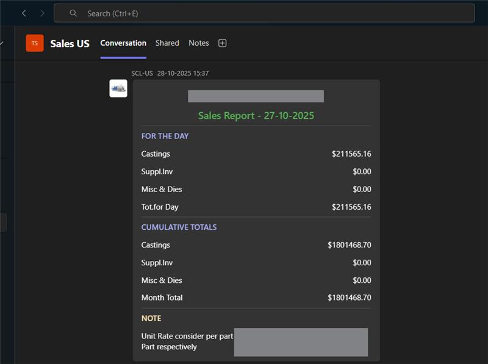

#Sales Report Monitor → Microsoft Teams


Automated **Sales Report Monitoring and Microsoft Teams Notification System**.

This Python service watches a folder for new ** Sales report files**, parses the data, and automatically sends a **formatted Adaptive Card** to a Microsoft Teams channel.

Designed for **daily production / sales reporting automation** in manufacturing environments.

---

# Teams Notification Preview

<p align="center">
  
</p>

Example card sent automatically to Teams containing:

* Daily Sales
* Cumulative Sales
* Month Total
* Optional Notes

---

# System Overview

The system continuously monitors a directory for files containing:

```
_SALES
```

When detected:

1. File is parsed
2. Sales values are extracted
3. Data is formatted into a **Microsoft Adaptive Card**
4. Card is posted to **Teams via Webhook**

---

# Architecture

```
Production System
      │
      │ generates
      ▼
 Sales Report File
      │
      ▼
Watchdog File Monitor
      │
      ▼
Sales Report Parser
      │
      ▼
Adaptive Card Builder
      │
      ▼
Microsoft Teams Webhook
      │
      ▼
Teams Channel Notification
```

---

# Features

### Automated Monitoring

* Watches a folder for new sales files
* Detects only files containing **_SALES**
* Avoids duplicate processing

### Smart Parsing

Handles multiple formatting variations such as:

```
$1,234.56
$ 1,234.56
1,234.56
$11.83-
$ 11.83 -
```

Automatically normalizes values.

### Adaptive Card Generation

Creates a structured Teams card with:

**FOR THE DAY**

* Castings
* Suppl.Inv
* Misc & Dies
* Tot.for Day

**CUMULATIVE TOTALS**

* Castings
* Suppl.Inv
* Misc & Dies
* Month Total

**NOTE**

Optional multiline message from report.

---

# Example Sales Report Format

```
FOR THE DAY

Castings        $211565.16
Suppl.Inv       $0.00
Misc & Dies     $0.00
Tot.for Day     $211565.16

CUMULATIVE TOTALS

Castings        $1801468.70
Suppl.Inv       $0.00
Misc & Dies     $0.00
Month Total     $1801468.70

Note :
Unit Rate consider per part
Part respectively
```

---

# Project Structure

```
-sales-monitor
│
├── sales_monitor.py
├── README.md
├── assets
│   └── teams_sales_card.png
│
├── logs
│   └── dcd_sales_monitor.log
```

---

# Installation

## 1 Clone Repository

```bash
git clone https://github.com/yourname/-sales-monitor.git
cd -sales-monitor
```

---

## 2 Create Virtual Environment

```bash
python -m venv .venv
```

Activate:

Windows

```
.venv\Scripts\activate
```

Linux / Mac

```
source .venv/bin/activate
```

---

## 3 Install Dependencies

```
pip install watchdog requests
```

---

# Configuration

Inside the script:

```python
MONITORED_DIR = r"C:\Karthikeyan-Data\Teams_US\Upload"
TEAMS_WEBHOOK_URL = ""
```

You can also set webhook as environment variable:

```
set TEAMS_WEBHOOK_URL=https://outlook.office.com/webhook/...
```

---

# Running the Monitor

```
python sales_monitor.py
```

Output example:

```
Watching folder: C:\Karthikeyan-Data\Teams_US\Upload
Valid file detected: _SALES_2025.txt
Adaptive Card sent to Teams
Processed file: _SALES_2025.txt
```

---

# Testing With a File

You can test parsing without running the watcher:

```
python sales_monitor.py --test sample_sales.txt
```

This prints the Adaptive Card JSON.

---

# Logging

Log file:

```
dcd_sales_monitor.log
```

Example entries:

```
INFO Watching folder
INFO Valid file detected
INFO Adaptive Card sent to Teams
```

---

# Use Cases

Manufacturing plants often generate **daily production / sales summary files**.

This automation:

* Eliminates manual reporting
* Instantly informs management
* Keeps Teams channel updated
* Improves operational visibility

---

# Future Improvements

Possible enhancements:

* SQL / MongoDB logging
* Daily / monthly charts
* Email fallback alerts
* Multi-plant monitoring
* Power BI integration
* Dashboard UI

---

# Author

Karthikeyan
Industrial Automation | Data Integration | Machine Vision

---

# License

MIT License